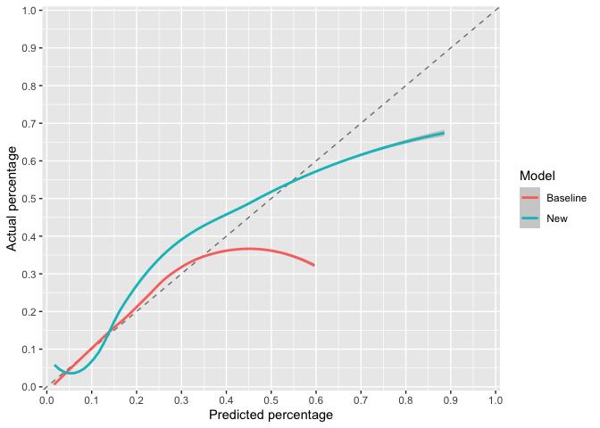
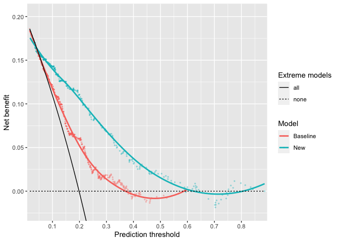
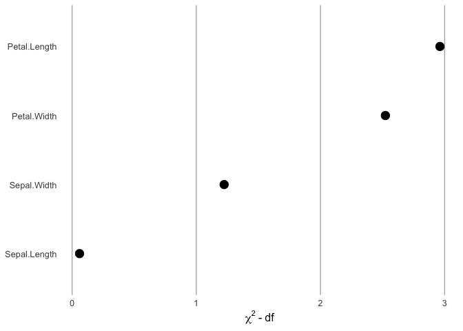

John W Pickering
27 June 2023

<!-- README.md is generated from README.Rmd. Please edit that file -->

# rap

<!-- badges: start -->
<!-- badges: end -->

The rap package contains functions for generating statistical metrics
and visual means to assess the improvement in risk prediction of one
risk model over another. It includes the Risk Assessment Plot (hence
rap).

## Installation

You can install the development version or rap from
[GitHub](https://github.com/) with:

``` r
# install.packages("devtools")
devtools::install_github("JohnPickering/rap")
```

## History and versions

rap began as Matlab code in 2012 after I wrote a paper
(<a href="https://cjasn.asnjournals.org/content/7/8/1355"
target="_blank">1</a>) for the Nephrology community on assessing the
added value of one biomarker to a clinical prediction model. I worked
with Professor Zoltan Endre on that paper. Dr David Cairns kindly
provided some R code for the Risk Assessment Plot. This formed the basis
of versions 0.1 to 0.4. Importantly, for those versions and the current
version all errors are mine (sorry) and not those of Professor Endre or
Dr Cairns. Since writing that paper I’ve come to consider some metrics
as not helpful. So, for the current version I have dropped some
statistical metrics that I believe are poor or wrongly applied. In
particularly, I dropped providing the total NRI (Net Reclassification
Improvement) and total IDI (Integrated Discrimination Improvement)
metrics. These should never be presented because they inappropriately
add together two fractions with differing denominators (NRI) or two
means (IDI). Instead, these the NRIs and IDIs for those with and without
the event of interest should be provided. Third, I have provided the
change in AUCs rather than a p-value because the change is much more
meaningful.

Version 1.03 were major changes:  
\* allowed as input logistic regression models from glm (stats) and lrm
(rms) as well as risk predictions calculated elsewhere. \* provided as
outputs in addition to the Risk Assessment Plot, a form of calibration
plot and decision curve.  
\* the output from the main functions CI.raplot, and CI.classNRI are now
lists that include the metrics for each bootstrap sample as well as the
summary metrics. CI.classNRI also produces confusion matrices for those
with and without the event of interest (separately). Bootstrapping is
used to determine confidence intervals.

Version 1.10 :  
\* addition of ROC plot. \* calibration plot now uses (best practice)
continuous curves (the old format is now “ggcalibrate_original()”).  
\* addition of precision recall curves. \* all plots can be for one or
two models.

Version 1.11 (current):  
\* made NRI metrics for models optional (use NRI_return = TRUE) to get
them. \* changed behaviour to that “x2 = NULL” is possible for
CI.raplot. It has the effect of creating a model where every probability
is 0.5.  
\* bug fix.

## Example 1

This is a basic example for assessing the difference between two
logistic regression models:

``` r
library(dplyr)
library(rap)

## basic example code

#### First make sure that data used has no missing values
df <- data_risk %>% 
  dplyr::filter(!is.na(baseline))%>% 
  dplyr::filter(!is.na(new))%>% 
  dplyr::filter(!is.na(outcome))

baseline_risk <- df$baseline    # or the baseline glm model itself
new_risk <- df$new              # or the new glm model itself
outcome <- df$outcome

assessment <- CI.raplot(x1 = baseline_risk, x2 = new_risk, y = outcome,
                        n.boot = 20, dp = 2) # Note the default is 1000 bootstraps (n.boot = 1000).  This can take quite some time to run, so when testing I use a smaller number of bootstraps.  

# View results  
## meta data  
(assessment$meta_data)
#>   Thresholds Confidence.interval Number.of.bootstraps Input.data.type
#> 1   baseline                  95                   20   User supplied
#>   X..decimal.places
#> 1                 2

## exact point estimates  
(assessment$Metrics)
#> $n
#> [1] 433
#> 
#> $n_event
#> [1] 86
#> 
#> $n_non_event
#> [1] 347
#> 
#> $Prevalence
#> [1] 0.1986143
#> 
#> $IDI_event
#> [1] 0.1363479
#> 
#> $IDI_nonevent
#> [1] 0.03397117
#> 
#> $IP_baseline
#> [1] 0.1849132
#> 
#> $IS_baseline
#> [1] 0.2516693
#> 
#> $IP_new
#> [1] 0.1504058
#> 
#> $IS_new
#> [1] 0.388494
#> 
#> $Brier_baseline
#> [1] 0.1500246
#> 
#> $Brier_new
#> [1] 0.123228
#> 
#> $Brier_skill
#> [1] 17.86145
#> 
#> $AUC_baseline
#> [1] 0.6823772
#> 
#> $AUC_new
#> [1] 0.8227331
#> 
#> $AUC_difference
#> [1] 0.1403559

## bootstrap derived metrics with confidence intervals  
(assessment$Summary_metrics)
#> # A tibble: 16 × 2
#>    metric         statistics                 
#>    <chr>          <chr>                      
#>  1 n              433 (CI: 433 to 433)       
#>  2 n_event        83.5 (CI: 72.47 to 103.1)  
#>  3 n_non_event    349.5 (CI: 329.9 to 360.52)
#>  4 Prevalence     0.19 (CI: 0.17 to 0.24)    
#>  5 IDI_event      0.14 (CI: 0.11 to 0.18)    
#>  6 IDI_nonevent   0.04 (CI: 0.02 to 0.05)    
#>  7 IP_baseline    0.19 (CI: 0.18 to 0.2)     
#>  8 IS_baseline    0.25 (CI: 0.24 to 0.26)    
#>  9 IP_new         0.15 (CI: 0.13 to 0.16)    
#> 10 IS_new         0.4 (CI: 0.36 to 0.43)     
#> 11 Brier_baseline 0.15 (CI: 0.13 to 0.17)    
#> 12 Brier_new      0.12 (CI: 0.1 to 0.14)     
#> 13 Brier_skill    20.46 (CI: 12.6 to 26.52)  
#> 14 AUC_baseline   0.66 (CI: 0.64 to 0.72)    
#> 15 AUC_new        0.83 (CI: 0.79 to 0.87)    
#> 16 AUC_difference 0.15 (CI: 0.12 to 0.19)
```

## Graphical assessments

### The Risk Assessment Plot

``` r
ggrap(x1 = baseline_risk, x2 = new_risk, y = outcome)
```


``` r

# for Single risks x2 = NULL
```

### The calibration curve

``` r
ggcalibrate(x1 = baseline_risk, x2 = new_risk, y = outcome)
```



### The original calibration curve

``` r
ggcalibrate_original(x1 = baseline_risk, x2 = new_risk, y = outcome,  cut_type = "interval")
#> $g
```


### The decision curve

``` r
ggdecision(x1 = baseline_risk, x2 = new_risk, y = outcome)
```



### The precision-recall curve

``` r
ggprerec(x1 = baseline_risk, x2 = new_risk, y = outcome)
```


### The roc plot

``` r
ggroc(x1 = baseline_risk, x2 = new_risk, y = outcome, carrington_line = TRUE)
```


Note, there are additional options for the ROC plot including labelling
points and distinguishing areas of the plot that are diagnostic from
those that are not.

### The contribution plot

``` r
load("inst/extdata/fit_example")
ggcontribute(x1 = eg_fit.glm)
```



## Example 2

This is a basic example for assessing the difference in the results of
reclassification:

``` r
## basic example code

baseline_class <- data_class$base_class
new_class <- data_class$new_class
outcome_class <- data_class$outcome

class_assessment <- CI.classNRI(c1 = baseline_class, c2 = new_class, y = outcome_class, 
                                n.boot = 20, dp = 2) # Note the default is 2000 bootstraps (n.boot = 2000).  This can take quite some time to run, so when testing I use a smaller number of bootstraps.  

# View results  
## meta data  
(class_assessment$meta_data)
#>   Confidence.interval Number.of.bootstraps X..decimal.places
#> 1                  95                   20                 2

## exact point estimates and confusion matrices
(class_assessment$Metrics)
#> $n
#> [1] 444
#> 
#> $n_event
#> [1] 62
#> 
#> $n_non_event
#> [1] 382
#> 
#> $Prevalence
#> [1] 0.1396396
#> 
#> $NRI_up_event
#> [1] 21
#> 
#> $NRI_up_nonevent
#> [1] 94
#> 
#> $NRI_down_event
#> [1] 5
#> 
#> $NRI_down_nonevent
#> [1] 71
#> 
#> $NRI_event
#> [1] 0.2580645
#> 
#> $NRI_nonevent
#> [1] -0.06020942
#> 
#> $wNRI_event
#> NULL
#> 
#> $wNRI_nonevent
#> NULL
#> 
#> $confusion.matrix_event
#>          New
#> Baseline  class_1 class_2 class_3 class_4 class_5 class_6
#>   class_1       0       0       0       0       0       0
#>   class_2       0       2       3       0       0       0
#>   class_3       0       1       0       2       0       0
#>   class_4       0       0       2       9      11       1
#>   class_5       0       0       0       2      25       4
#>   class_6       0       0       0       0       0       0
#> 
#> $confusion.matrix_nonevent
#>          New
#> Baseline  class_1 class_2 class_3 class_4 class_5 class_6
#>   class_1       0       0       0       0       0       0
#>   class_2       9      52      17       3       1       0
#>   class_3       2      29      66      44       3       0
#>   class_4       0       2      21      52      25       0
#>   class_5       0       0       0       8      47       1
#>   class_6       0       0       0       0       0       0

## bootstrap derived metrics with confidence intervals  
(class_assessment$Summary_metrics)
#> # A tibble: 10 × 2
#>    metric            statistics                 
#>    <chr>             <chr>                      
#>  1 n                 444 (CI: 444 to 444)       
#>  2 n_event           61.5 (CI: 49.9 to 73.53)   
#>  3 n_non_event       382.5 (CI: 370.48 to 394.1)
#>  4 Prevalence        0.14 (CI: 0.11 to 0.17)    
#>  5 NRI_up_event      21 (CI: 15.95 to 25.05)    
#>  6 NRI_up_nonevent   94 (CI: 77.47 to 108.62)   
#>  7 NRI_down_event    4 (CI: 1 to 8.05)          
#>  8 NRI_down_nonevent 67.5 (CI: 59 to 86.53)     
#>  9 NRI_event         0.27 (CI: 0.15 to 0.38)    
#> 10 NRI_nonevent      -0.07 (CI: -0.12 to 0.01)
```
